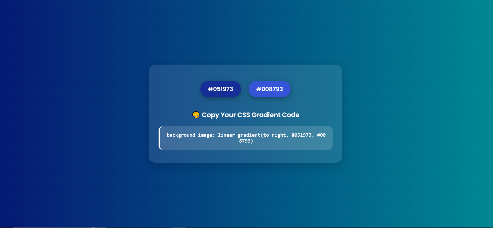

<h1 align="center">🎨 Gradient Selector</h1>


<p align="center">
  <b>A clean and interactive tool to create beautiful CSS linear gradients with just a click.</b><br/>
  Select random colors, preview them live, and copy the CSS gradient code instantly.
</p>

<p align="center">
  
  
  
</p>

---

## ✨ Features

- 🎨 Randomly generate linear gradient backgrounds
- 🚀 Real-time background updates
- 📋 One-click CSS code copy
- 💅 Hover effects with shadow animations
- 📱 Responsive and visually pleasing UI

---

## 🛠️ Tech Stack

- **HTML5** – For structure
- **CSS3** – For styling and hover effects
- **Vanilla JavaScript** – For interactivity and logic

---

## 🧪 How to Use

1. Clone this repository:

    ```bash
    git clone https://github.com/Neerajkumar151/gradient-selector-first-js-project.git
    ```

2. Open `index.html` in your browser.

3. Click on any of the two buttons to change the gradient colors.

4. Copy the generated CSS code by clicking on the code box.

---

## 🔍 Demo


<p>Try it live on <a href="https://neerajkumar151.github.io/gradient-selector-first-js-project/gradient_selector" target="_blank">GitHub Pages</a></p>


---

## 📸 Screenshot

<p align="center">
  
</p>

---

## 🤝 Contributing

Contributions, issues and feature requests are welcome!

Feel free to fork the repo and create a pull request.

---

## 🙋‍♂️ Author

**Neeraj Kumar**  
B.Tech IT Final Year Student  
[GitHub](https://github.com/Neerajkumar151) | [LinkedIn](https://www.linkedin.com/in/neerajkumar1517/)

---

⭐ If you liked the project, don’t forget to leave a star!
